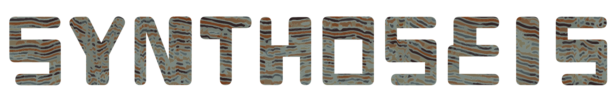

# synthoseis



Generating seismic data and associated labels to train deep learning networks.

## Overview

Synthoseis is an open-source, Python-based tool used for generating pseudo-random seismic data, as described in [Synthetic seismic data for training deep learning networks](https://library.seg.org/doi/abs/10.1190/int-2021-0193.1).

The goal of synthoseis is to generate realistic seismic data for training a deep learning network to identify features of interest in field-acquired seismic data.
Such training data should be plentiful, cover a diverse range of subsurface scenarios and provide quality training labels.

## Documentation

Read our documentation: https://sede-open.github.io/synthoseis/datagenerator.html

## Installation

Install with [uv](https://docs.astral.sh/uv/) (recommended). Dependencies are declared in `pyproject.toml` / `uv.lock` — there is no `environment.yml`.

```bash
# Install uv if needed: https://docs.astral.sh/uv/getting-started/installation/
uv sync
```

For development (includes pytest):

```bash
uv sync --group dev
```

### Rust-backed MDIO (maturin / PyO3)

Preferred Python entry for Rust MDIO create / write / read (no `cargo` subprocess).
Requires a **Rust** toolchain and [maturin](https://www.maturin.rs/):

```bash
uv sync --group dev
maturin develop --manifest-path rust/synthoseis-py/Cargo.toml
uv run pytest tests/test_mdio_bindings.py -q
```

Details: [`rust/synthoseis-py/README.md`](rust/synthoseis-py/README.md). The `#8` Python
`mdio` open interop workflow remains available separately.

> **Python version:** Synthoseis requires **Python 3.12 or later** (`requires-python` in `pyproject.toml`).

## Resources

### Quick Start

Run a model with parameters provided in the example config file

```bash
uv sync
uv run python main.py --config config/example.json --num_runs 1 --run_id seismic_example
```

### Interactive Dashboard

See repository docs / `scripts/dev.sh` for the FastAPI + Vite dashboard.

## Contributing

We welcome all kinds of contributions. The preferred way of submitting a contribution is to either make an issue on GitHub or by forking the project on GitHub and making a pull request.

## Citation

```
@article{doi:10.1190/INT-2021-0193.1,
author = {Tom P. Merrifield and Donald P. Griffith and S. Ahmad Zamanian and Stephane Gesbert and Satyakee Sen and Jorge De La Torre Guzman and R. David Potter and Henning Kuehl},
title = {Synthetic seismic data for training deep learning networks},
journal = {Interpretation},
volume = {10},
number = {3},
pages = {SE31-SE39},
year = {2022},
doi = {10.1190/INT-2021-0193.1},
```
