# synthoseis


Generating seismic data and associated labels to train deep learning networks.

## Overview

Synthoseis is an open-source, Python-based tool used for generating pseudo-random seismic data, as described in [Synthetic seismic data for training deep learning networks](https://library.seg.org/doi/abs/10.1190/int-2021-0193.1).

The goal of synthoseis is to generate realistic seismic data for training a deep learning network to identify features of interest in field-acquired seismic data.
Such training data should be plentiful, cover a diverse range of subsurface scenarios and provide quality training labels.

## Documentation

Read our documentation: https://sede-open.github.io/synthoseis/datagenerator.html

## Installation

Install with [uv](https://docs.astral.sh/uv/) (recommended). Dependencies are declared in `pyproject.toml` / `uv.lock` — there is no `environment.yml`.

```bash
# Install uv if needed: https://docs.astral.sh/uv/getting-started/installation/
uv sync
```

For development (includes pytest):

```bash
uv sync --group dev
```

### Rust-backed MDIO (maturin / PyO3)

Preferred Python entry for Rust MDIO create / write / read (no `cargo` subprocess).
Requires a **Rust** toolchain and [maturin](https://www.maturin.rs/):

```bash
uv sync --group dev
maturin develop --manifest-path rust/synthoseis-py/Cargo.toml
uv run pytest tests/test_mdio_bindings.py -q
```

Details: [`rust/synthoseis-py/README.md`](rust/synthoseis-py/README.md). The `#8` Python
`mdio` open interop workflow remains available separately.

> **Python version:** Synthoseis requires **Python 3.12 or later** (`requires-python` in `pyproject.toml`).

## Resources

### Quick Start

Run a model with parameters provided in the example config file

```bash
uv sync
uv run python main.py --config config/example.json --num_runs 1 --run_id seismic_example
```

### Interactive Dashboard

Synthoseis ships with an interactive web dashboard that lets you configure and launch generation runs, monitor progress in real time, and explore outputs.

#### Prerequisites

- [uv](https://docs.astral.sh/uv/) — Python package/project manager  
- [Node.js](https://nodejs.org) (includes `npm`) — required for the web frontend

#### Start the dashboard

From the repository root run the single dev-launch script:

```bash
./scripts/dev.sh
```

This starts both services in parallel and shuts them both down cleanly on `Ctrl-C`:

| Service | URL |
|---------|-----|
| REST API (FastAPI / uvicorn) | http://localhost:8000 |
| Web app (Vite / React) | http://localhost:5173 |

On first run `dev.sh` will automatically install the webapp's Node dependencies if `webapp/node_modules` is not present.

#### What you can do in the dashboard

- Fill in a generation config via a guided form (no manual JSON editing required)
- Kick off one or more generation runs and watch live log output
- Browse completed models and QC images directly in the browser

### Overview of workflow

```
Load user-parameters from config file
Build initial horizon at base and deposit layers of random thickness on top until some minimum depth is reached
Choose facies for each layer
Convert stack of horizons into a geologic age model
Generate faults and apply to age model
Identify closures using flood-filling algorithm
Fill closures randomly with fluids
Calculate elastic rock properties
Calculate reflection coefficients for each required incident angle
Apply random noise
Convolve using Butterworth bandpass filter to generate bandlimited seismic reflectivity
Apply geophysical augmentation (such as lateral smoothing, trace integration, amplitude balancing, RMO)
```

### User parameters

An example user-parameter json format file is provided in the config folder, and is used to set parameters for generating a batch of training data.

See `config/example.json` for the full parameter set (cube_shape, faults, closures, bandwidth, rock-physics project, QC flags, etc.).

### Rock properties

An example rock property model is provided in [rpm_example.py](rockphysics/rpm_example.py). Add new models under `rockphysics/` and point `project` in the config at the module name.

## Examples Gallery

### Geologic Age

<table>
<tr>
  <td>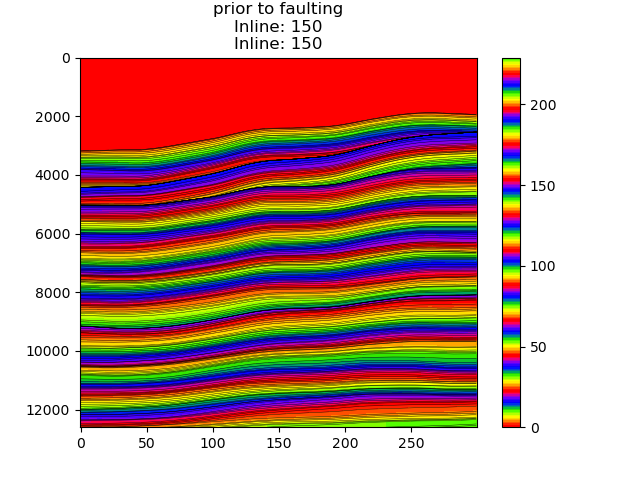</td>
  <td>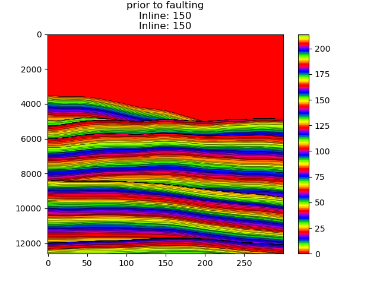</td>
  <td>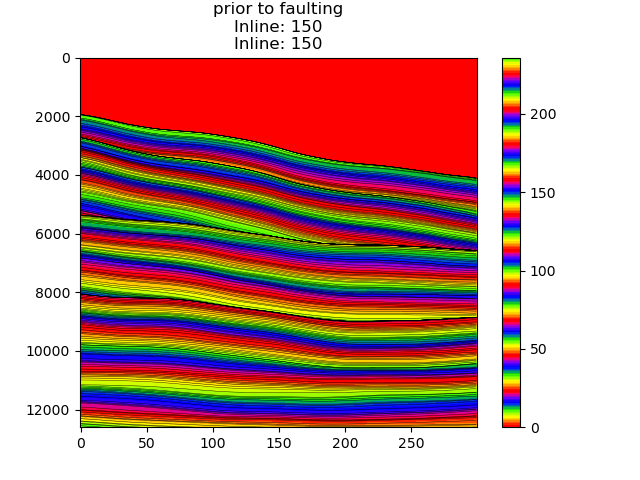</td>
</tr>
</table>

### Basin Floor Fans

<table>
<tr>
  <td>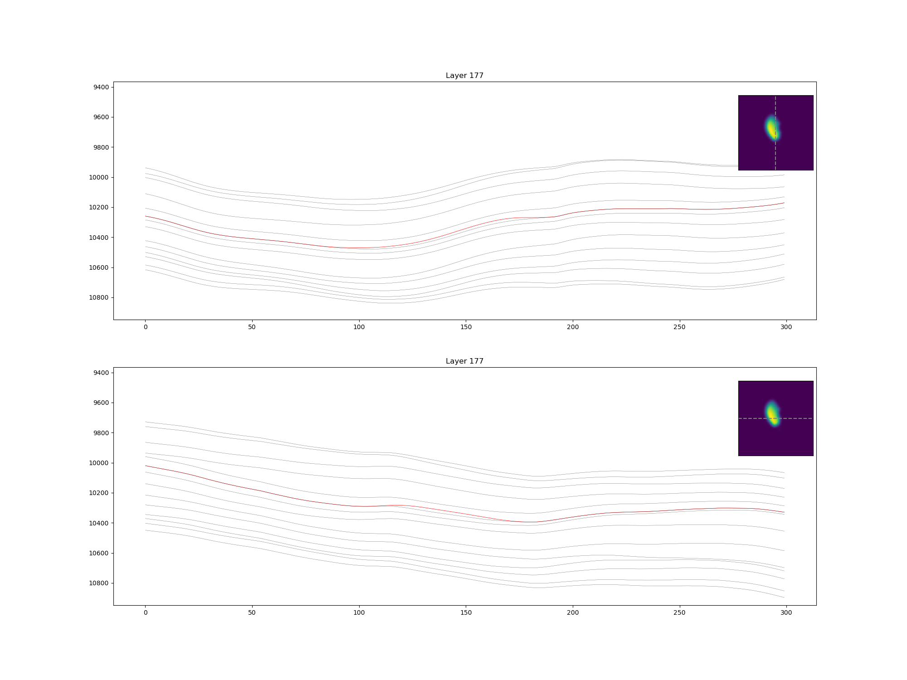</td>
  <td>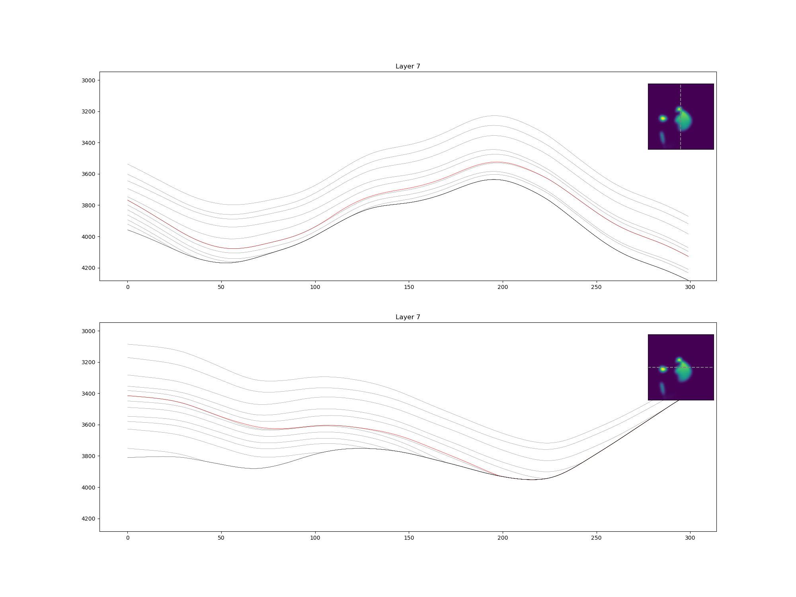</td>
  <td></td>
</tr>
</table>

### Salt Bodies

Cross-section through example salt bodies, coloured by lithology, where shale=0, sand=1, salt=2

<table>
<tr>
  <td>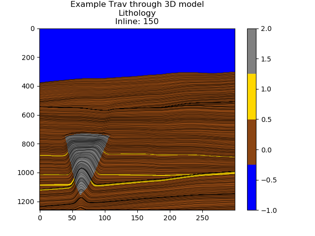</td>
  <td>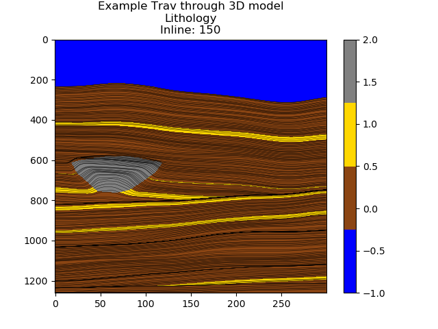</td>
  <td>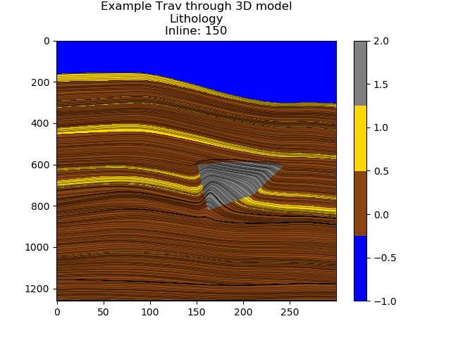</td>
</tr>
</table>

### Faulting Styles

Faulting style is chosen from self branching, stair case, horst graben or relay ramp (left to right).

<table><tr>
  <td>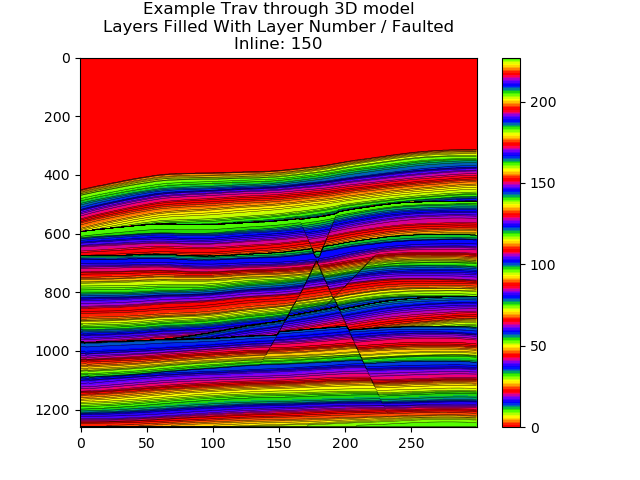</td>
  <td>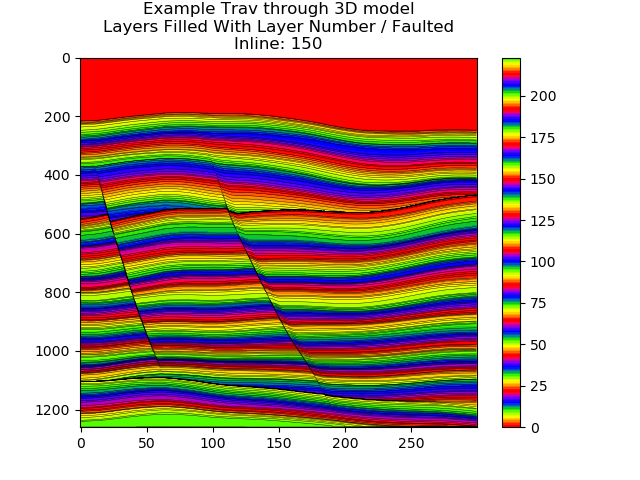</td>
  <td>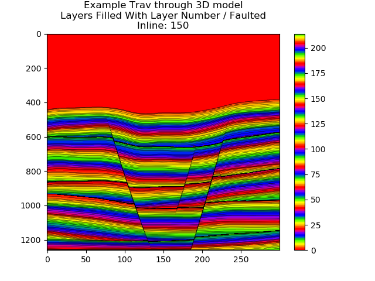</td>
  <td>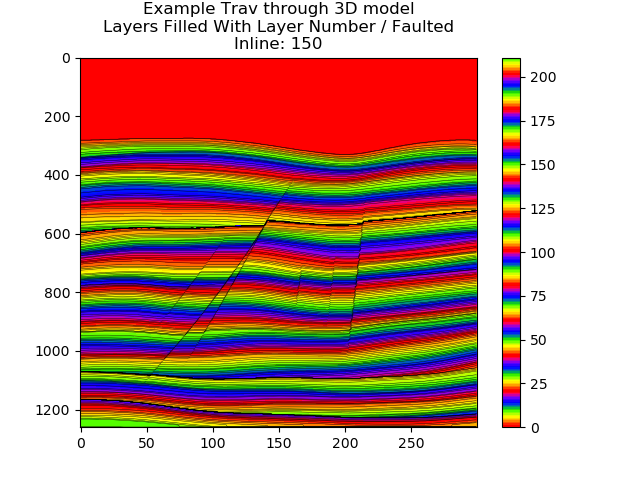</td>
</tr></table>

### Closures

<table>
<tr>
  <td>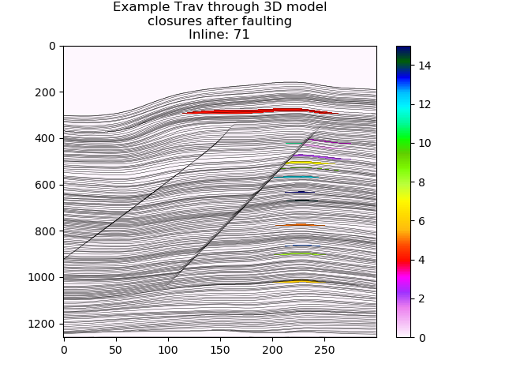</td>
  <td>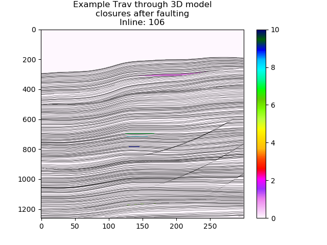</td>
  <td>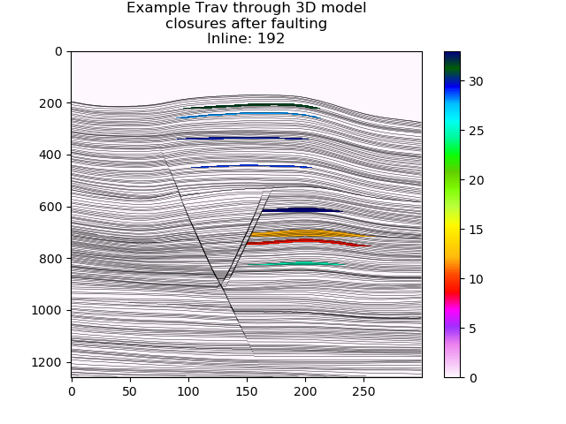</td>
</tr>
</table>

### Seismic Data

<table>
<tr>
  <td>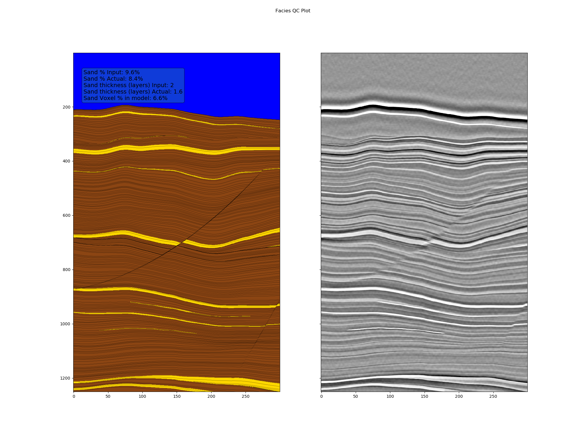</td>
  <td>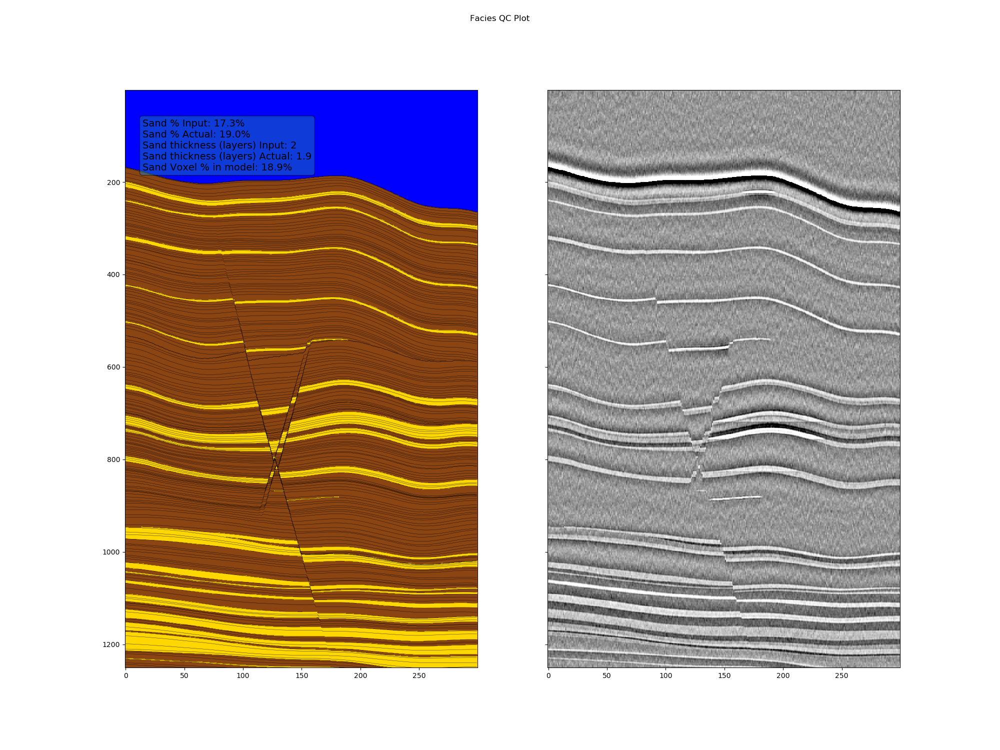</td>
  <td>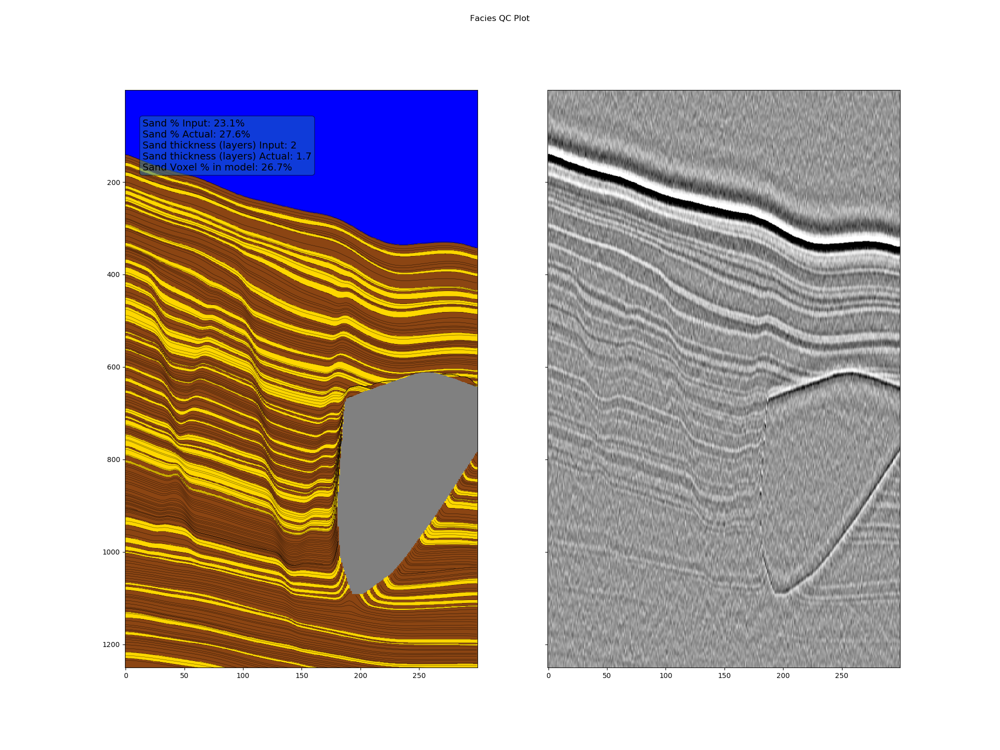</td>
</tr>
</table>

## Contributing

We welcome all kinds of contributions. The preferred way of submitting a contribution is to either make an issue on GitHub or by forking the project on GitHub and making a pull request.

## Citation

```
@article{doi:10.1190/INT-2021-0193.1,
author = {Tom P. Merrifield and Donald P. Griffith and S. Ahmad Zamanian and Stephane Gesbert and Satyakee Sen and Jorge De La Torre Guzman and R. David Potter and Henning Kuehl},
title = {Synthetic seismic data for training deep learning networks},
journal = {Interpretation},
volume = {10},
number = {3},
pages = {SE31-SE39},
year = {2022},
doi = {10.1190/INT-2021-0193.1},
```
